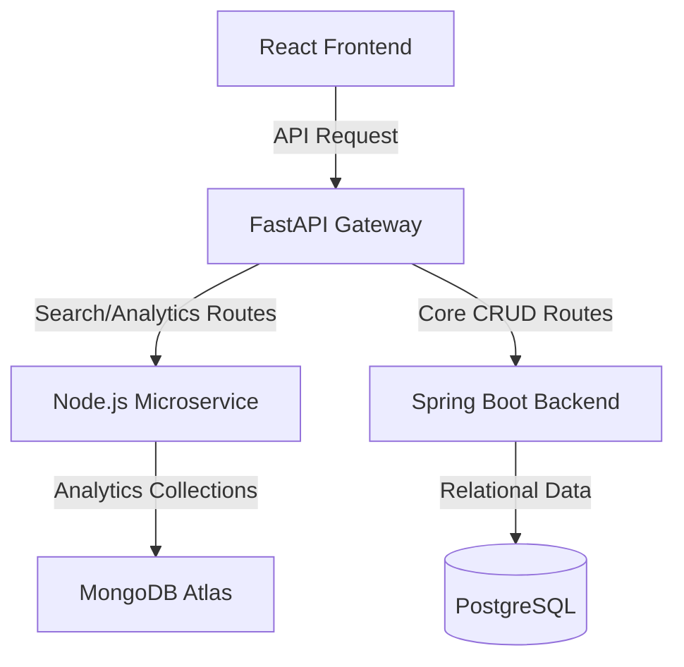

# SearchHub Analytics Service (Node.js & MongoDB Atlas)

This microservice acts as the Search Analytics and Dynamic Search Data engine for the Multi-Category Search & Filter Platform. It handles search logging, trending keywords, popular search categories, user search history, dynamic auto-suggestions, and admin dashboard statistics.

## Tech Stack
* **Runtime**: Node.js
* **Framework**: Express.js
* **Database Client**: Mongoose (MongoDB Atlas)
* **Loggers/Helpers**: Morgan, Cors, Dotenv

## Architecture Overview


---

## Getting Started

### 1. Installation
Navigate to the `Nodejs` folder and install dependencies:
```bash
cd Nodejs
npm install
```

### 2. Configuration (`.env`)
Create a `.env` file from the provided example:
```env
PORT=5001
MONGO_URI=mongodb+srv://Admin:<PASSWORD>@cluster0.svg74nb.mongodb.net/searchhub_analytics?retryWrites=true&w=majority&appName=Cluster0
```
Make sure to replace `<PASSWORD>` with your actual MongoDB Atlas password.

### 3. Run the Microservice
Start the development server with hot-reloading:
```bash
npm run dev
```
Start the production server:
```bash
npm start
```

---

## API Documentation

### 📶 Test & Connectivity

#### 1. Service Health Check
* **Endpoint**: `GET /api/test`
* **Description**: Verifies if the Node.js express server is running.
* **Response**:
  ```json
  { "status": "OK" }
  ```

#### 2. MongoDB Connection Check
* **Endpoint**: `GET /api/test/db`
* **Description**: Runs a diagnostic check by inserting, reading, and deleting a mock search log to verify the MongoDB Atlas connection.
* **Response (Success)**:
  ```json
  { "mongodb": "Connected" }
  ```

---

### 🔍 Search & Logs

#### 3. Log Search Query
* **Endpoint**: `POST /api/search`
* **Description**: Logs a search submission. Increments trending keywords count, popular categories count, stores history, and updates admin analytics.
* **Request Body**:
  ```json
  {
    "userId": "user-unique-id",
    "email": "user@example.com",
    "keyword": "java course",
    "category": "Courses",
    "sessionId": "session-uuid"
  }
  ```

#### 4. Get Search History
* **Endpoint**: `GET /api/search/history/:userId`
* **Description**: Retrieves full search history and frequent searches for a user.
* **Response**:
  ```json
  {
    "history": [ ... ],
    "searchCount": 12,
    "frequentlySearched": [ { "keyword": "java", "count": 5 } ]
  }
  ```

#### 5. Get Recent Searches
* **Endpoint**: `GET /api/search/recent/:userId`
* **Description**: Retrieves the 10 most recent search terms for a user.

#### 6. Clear User History
* **Endpoint**: `DELETE /api/search/history/user/:userId`
* **Description**: Clears all search history and recent searches for a user.

#### 7. Delete Search History Entry
* **Endpoint**: `DELETE /api/search/history/:id`
* **Description**: Deletes a single history record.

---

### 📈 Analytics & Auto-Suggestions

#### 8. Auto-Suggestions (Prefix Matching)
* **Endpoint**: `GET /api/search/suggestions?q=:query`
* **Description**: Provides auto-suggestions based on keyword prefix matching against the trending keywords collection.
* **Response**:
  ```json
  [ "java", "javascript", "ja-book" ]
  ```

#### 9. Trending Keywords
* **Endpoint**: `GET /api/search/trending`
* **Description**: Returns top searched keywords sorted by hit frequency.

#### 10. Popular Categories
* **Endpoint**: `GET /api/search/categories`
* **Description**: Returns top searched categories sorted by hit frequency.

#### 11. Admin Dashboard Statistics
* **Endpoint**: `GET /api/admin/dashboard`
* **Description**: Returns aggregated metrics (total search counts, today's search counts, top queries, popular categories chart data, and 7-day search trends).
