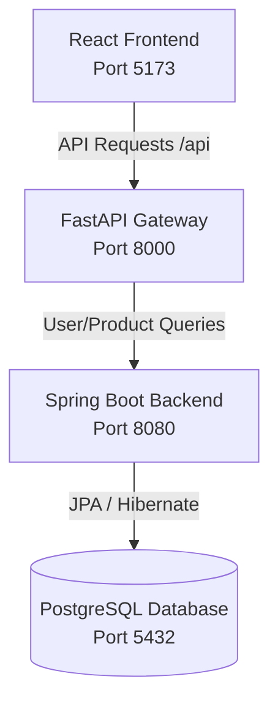

# SearchHub — Multi-Category Search & Filter Platform

SearchHub is a full-stack, three-tier application designed to search and filter resources across multiple categories (e.g., Electronics, Education, Books, Courses, Learning Resources, and Technology Tools). 

It features a React UI, a FastAPI Gateway for orchestration, and a Spring Boot Backend connected to PostgreSQL.

---

## 🏛️ Architecture Overview

SearchHub operates on a modern, decoupled architecture:



1. **Frontend (React + Vite)**: A responsive and clean UI with smart filtering, advanced faceted search, and an administrative dashboard.
2. **Gateway (FastAPI)**: Serves as the entry gateway. Handles CORS, registers auth, proxies routes, manages token state, and orchestrates services.
3. **Backend (Spring Boot + JPA)**: The core data and business logic layer, managing persistence of products, courses, and user profiles.
4. **Database (PostgreSQL)**: Stores user details, product information, and course lists securely.

---

## 📁 Repository Structure

The project is organized as a clean monorepo:

```
Search-Hub/
├── backend/                  # Java Spring Boot Core Backend
│   ├── src/                  # Main & test Java sources
│   └── pom.xml               # Maven configuration
│
├── gateway/                  # FastAPI API Gateway & Orchestrator
│   ├── main.py               # Gateway entry with CORS
│   ├── run.py                # ASGI server script (Uvicorn)
│   ├── controllers/          # Endpoint controllers
│   ├── services/             # Core gateway services
│   ├── models/               # Schemas & Pydantic models
│   └── requirements.txt      # Python dependencies
│
├── frontend/                 # React + Vite Frontend UI
│   ├── src/                  # Components, Pages, Stores & API
│   ├── package.json          # Node dependencies
│   └── vite.config.js        # Vite compilation & proxy config
│
├── CONNECTION_GUIDE.md       # Integration guide for components
├── README.md                 # This file
├── start_frontend.sh/.bat    # Script to start React frontend
├── start_gateway.sh/.bat     # Script to start FastAPI Gateway
└── start_spring_backend.sh/.bat # Script to start Spring Boot Backend
```

---

## 🚀 Getting Started

Ensure you have the following prerequisites installed:
- **Node.js** (v16+ or newer)
- **Python 3.8+**
- **Java JDK 17** and **Maven**
- **PostgreSQL** (running locally on port `5432` with a database named `Seach-hub`)

### Quick Start (Using Scripts)

#### On Mac/Linux:
```bash
# 1. Start the core database backend (Spring Boot)
./start_spring_backend.sh

# 2. Start the API Gateway (FastAPI)
./start_gateway.sh

# 3. Start the UI (React)
./start_frontend.sh
```

#### On Windows:
```cmd
# 1. Start the core database backend (Spring Boot)
start_spring_backend.bat

# 2. Start the API Gateway (FastAPI)
start_gateway.bat

# 3. Start the UI (React)
start_frontend.bat
```

---

### Manual Step-by-Step Setup

#### 1. Database Setup
Create a PostgreSQL database named `Seach-hub`. Update credentials in `backend/src/main/resources/application.properties` if necessary:
```properties
spring.datasource.url=jdbc:postgresql://localhost:5432/Seach-hub
spring.datasource.username=postgres
spring.datasource.password=YOUR_PASSWORD
```

#### 2. Start Spring Boot Backend
```bash
cd backend
mvn clean install
mvn spring-boot:run
```
The Spring Boot backend will run on **http://localhost:8080**.

#### 3. Start FastAPI Gateway
```bash
cd gateway
# (Optional) Create & activate a virtual environment
python -m venv venv
source venv/bin/activate  # On Windows use: venv\Scripts\activate

pip install -r requirements.txt
python run.py
```
The gateway will start on **http://localhost:8000**. Documentation is available at **http://localhost:8000/docs**.

#### 4. Start React Frontend
Create a `.env` file in the `frontend/` directory:
```env
VITE_API_URL=http://localhost:8000/api
```
Run the UI:
```bash
cd frontend
npm install
npm run dev
```
The React frontend will spin up on **http://localhost:5173**.

---

## 📡 API Integration Details

### Unified Gateway Routes (`http://localhost:8000/api`)

| Method | Endpoint | Description |
|--------|----------|-------------|
| **POST** | `/api/auth/register` | Register a new account |
| **POST** | `/api/auth/login` | Login and receive a JWT token |
| **GET** | `/api/auth/profile` | Retrieve active user profile (requires Token) |
| **GET** | `/api/users` | List all users (FastAPI) |
| **PUT** | `/api/users/{id}` | Update user information and roles |
| **GET** | `/api/categories` | Retrieve search categories |
| **GET** | `/api/items` | Retrieve items & products |
| **POST** | `/api/items` | Create new item (Admin) |
| **PUT** | `/api/items/{id}` | Update item (Admin) |
| **DELETE** | `/api/items/{id}` | Delete item (Admin) |

---

## 🔐 Credentials & Role-Based Access

The frontend supports distinct views based on permissions:

- **Regular User**: `user@example.com` / `password123`
  - Access to search, browsing, purchasing, and the user dashboard.
- **Admin**: `admin@example.com` / `admin123`
  - Full access to the Admin Dashboard at `/admin` (management of products, courses, category additions, and system metrics).
